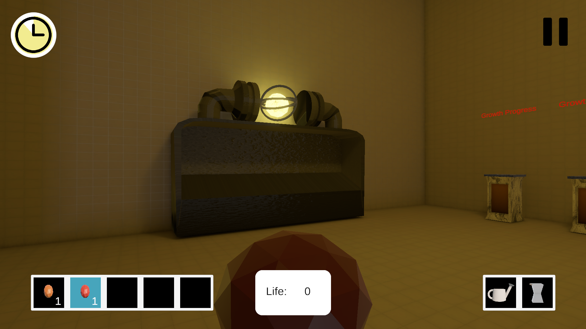
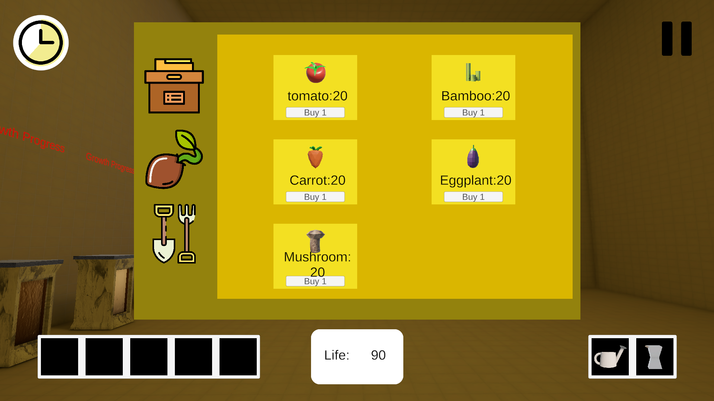
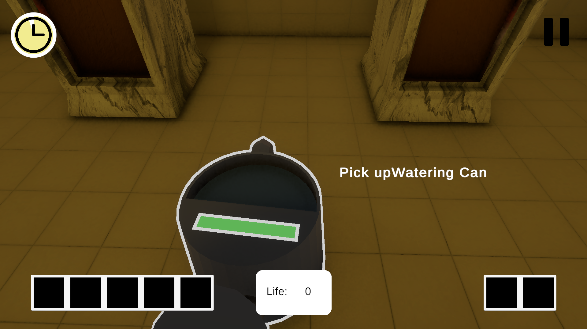
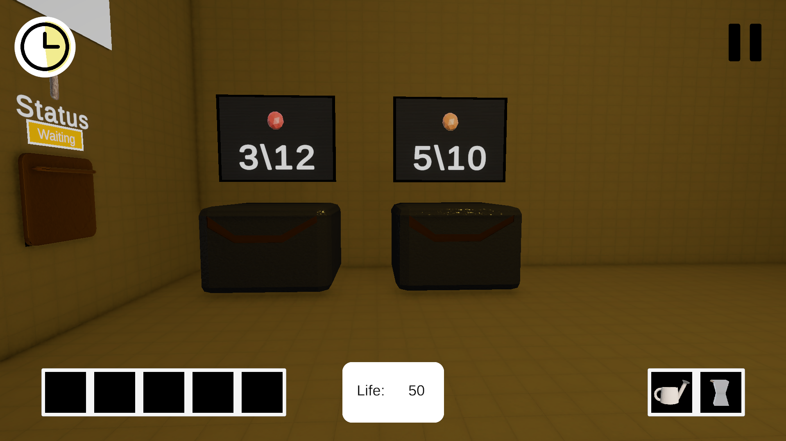
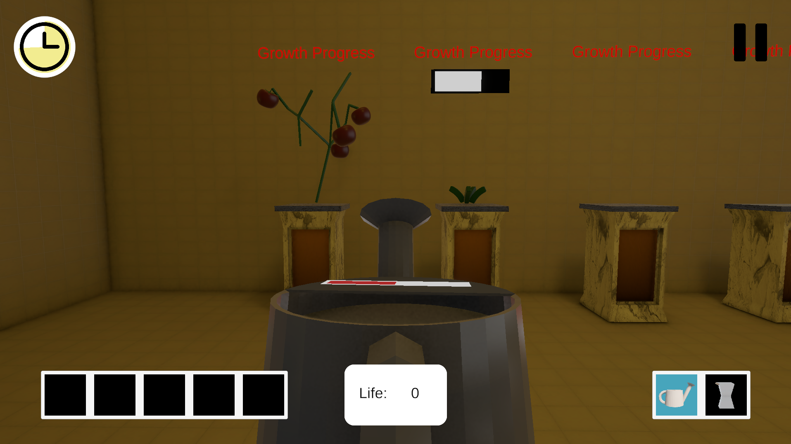

# A futursitic FPS farming Game. 

Thus Is the Gane I was doing during my semester end exams instead of studying :) I have tried and implemented multiple features I have never made before. 

<h2>Systems I implemented</h3>

An inventory system : 

A shop system :  

Multiple interactions :  

Baking lights :  

Time based stateMachines : 

Working on importing and managing blender models 

Here is the itch page : 
